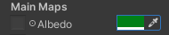
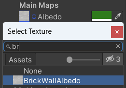
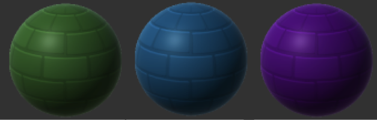

The material of a GameObject controls how it looks. A material can have a colour and a texture and there are lots of properties that you can adjust to get different effects. 

In the Project view, right-click and choose 'Create' -> 'Material'. Give the material a descriptive name such as 'Red Brick' or 'Snow'. 

Click on the colour next to 'Albedo' in the Inspector and choose a colour for your material. 

You can optionally add a texture by clicking on the circle to the left of 'Albedo' and selecting a texture. Note that textures are usually designed for a specific shape of object so the texture will need to be suitable for the shape you will be using it with. The 'Stone Wall' and 'Brick Wall' textures can be used on cube GameObjects. 

**Tip:** Adding both a colour and a texture will apply both the colour and texture to the material.

To add a material to a GameObject, navigate to the material in the Project window and drag the material over the GameObject in the scene view. The new material will be applied immediately. 

The **Tiling** property controls how the texture repeats. Bigger numbers will make the pattern smaller. 

You can adjust the **Tiling** and other properties in the Inspector for the Material, or in the Inspector for each GameObject that uses the texture. Experiment to get a result you like!

There are lots of other settings that you can experiment with to control how metallic the surface will be and how it reflects light. 
