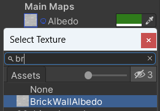

Le matériau d'un GameObject contrôle son apparence. Un matériau peut avoir une couleur et une texture et il existe de nombreuses propriétés que tu peux ajuster pour obtenir différents effets.

Dans la vue Project, fais un clic droit et choisis **Create** > **Material**. Donne au matériau un nom descriptif tel que « Brique rouge » ou « Neige ».

Clique sur la couleur à côté de « Albedo » dans l'Inspector et choisis une couleur pour ton matériau.

Tu peux éventuellement ajouter une texture en cliquant sur le cercle à gauche de « Albedo » et en sélectionnant une texture. Note que les textures sont généralement conçues pour une forme d'objet spécifique, la texture devra donc être adaptée à la forme avec laquelle tu l'utiliseras. Par exemple, les textures « Stone Wall » et « Brick Wall » peuvent être utilisées sur des GameObjects cubiques.

**Astuce :** ajouter à la fois une couleur et une texture appliquera à la fois la couleur et la texture au matériau.

Pour ajouter un matériau à un GameObject, va dans matériau dans la fenêtre Project et fais glisser le matériau sur le GameObject dans la vue Scene. Le nouveau matériau sera appliqué immédiatement.

La propriété **Tiling** contrôle la façon dont la texture se répète. Des nombres plus grands rendront le motif plus petit.

Tu peux ajuster le **Tiling** et d'autres propriétés dans l'Inspector du matériau, ou dans l'Inspector de chaque GameObject qui utilise la texture. Fais des essais pour obtenir un résultat qui te plaise !

Il y a beaucoup d'autres paramètres que tu peux expérimenter pour contrôler le degré de métallisation de la surface et la façon dont elle reflète la lumière. 
