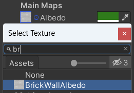

Het materiaal van een GameObject bepaalt hoe het eruitziet. Een materiaal kan een kleur en een structuur hebben en er zijn veel eigenschappen die je kunt aanpassen om verschillende effecten te krijgen.

Klik in de Projectweergave met de rechtermuisknop en kies **Create** > **Material**. Geef het materiaal een duidelijke naam zoals 'Rode Baksteen' of 'Sneeuw'.

Klik op de kleur naast 'Albedo' in de Inspector en kies een kleur voor je materiaal.

Als je wil kun je een textuur toevoegen door op de cirkel te klikken links van 'Albedo' en een textuur te selecteren. Houd er rekening mee dat texturen meestal zijn ontworpen voor een specifieke vorm van een object, dus de textuur moet geschikt zijn voor de vorm die je gebruikt. De texturen 'Stone Wall' en 'Brick Wall' kunnen bijvoorbeeld worden gebruikt op kubus GameObjects.

**Tip:** Als je zowel een kleur als een textuur toevoegt, wordt zowel de kleur als de textuur toegepast op het materiaal.

Om materiaal toe te voegen aan een GameObject, navigeer je naar het materiaal in het projectvenster en sleep je het materiaal over het GameObject in de scene view. Het nieuwe materiaal wordt direct toegepast.

De eigenschap **Tiling** bepaalt hoe de textuur wordt herhaald. Grotere getallen maken het patroon kleiner.

Je kunt de **Tiling** en andere eigenschappen aanpassen in de Inspector voor het materiaal, of in de Inspector voor elk GameObject dat de textuur gebruikt. Experimenteer om het gewenste resultaat te krijgen!

Er zijn tal van andere instellingen waarmee je kunt experimenteren om te bepalen hoe metaalachtig het oppervlak zal zijn en hoe het licht reflecteert. 
